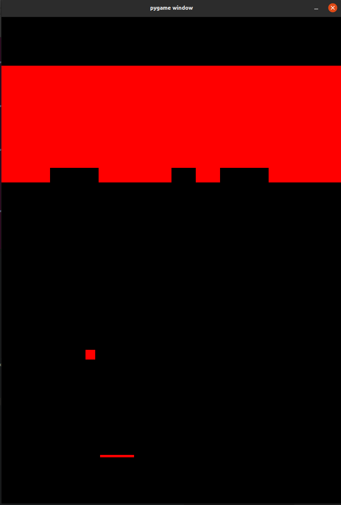

# Breakout AI with NEAT

This repository contains the code for a Breakout AI using the NEAT (NeuroEvolution of Augmenting Topologies) algorithm.



## Overview

The Breakout AI is implemented using the Pygame library for the game environment and NEAT for evolving artificial neural networks to control the game's paddle. The AI can be trained or tested based on the saved best genome.

## Requirements

- Python 3.8.10
- Pygame 2.5.2
- NEAT-Python library

Install the required dependencies using:

```bash
pip install -r requirements.txt

